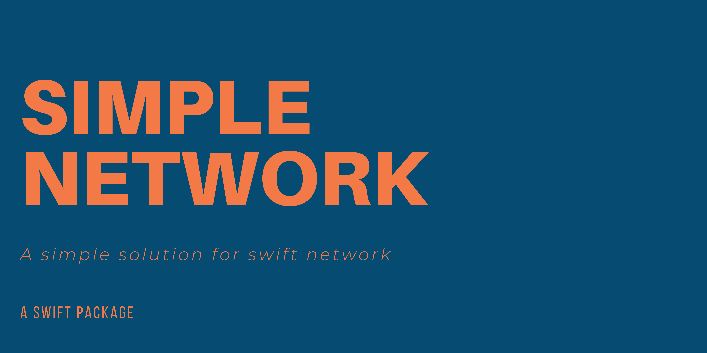

[](https://github.com/apple/swift)
[![swift-package-manager](https://img.shields.io/badge/package%20manager-compatible-brightgreen.svg?logo=data:image/svg+xml;base64,PD94bWwgdmVyc2lvbj0iMS4wIiBlbmNvZGluZz0iVVRGLTgiPz4KPHN2ZyB3aWR0aD0iNjJweCIgaGVpZ2h0PSI0OXB4IiB2aWV3Qm94PSIwIDAgNjIgNDkiIHZlcnNpb249IjEuMSIgeG1sbnM9Imh0dHA6Ly93d3cudzMub3JnLzIwMDAvc3ZnIiB4bWxuczp4bGluaz0iaHR0cDovL3d3dy53My5vcmcvMTk5OS94bGluayI+CiAgICA8IS0tIEdlbmVyYXRvcjogU2tldGNoIDYzLjEgKDkyNDUyKSAtIGh0dHBzOi8vc2tldGNoLmNvbSAtLT4KICAgIDx0aXRsZT5Hcm91cDwvdGl0bGU+CiAgICA8ZGVzYz5DcmVhdGVkIHdpdGggU2tldGNoLjwvZGVzYz4KICAgIDxnIGlkPSJQYWdlLTEiIHN0cm9rZT0ibm9uZSIgc3Ryb2tlLXdpZHRoPSIxIiBmaWxsPSJub25lIiBmaWxsLXJ1bGU9ImV2ZW5vZGQiPgogICAgICAgIDxnIGlkPSJHcm91cCIgZmlsbC1ydWxlPSJub256ZXJvIj4KICAgICAgICAgICAgPHBvbHlnb24gaWQ9IlBhdGgiIGZpbGw9IiNEQkI1NTEiIHBvaW50cz0iNTEuMzEwMzQ0OCAwIDEwLjY4OTY1NTIgMCAwIDEzLjUxNzI0MTQgMCA0OSA2MiA0OSA2MiAxMy41MTcyNDE0Ij48L3BvbHlnb24+CiAgICAgICAgICAgIDxwb2x5Z29uIGlkPSJQYXRoIiBmaWxsPSIjRjdFM0FGIiBwb2ludHM9IjI3IDI1IDMxIDI1IDM1IDI1IDM3IDI1IDM3IDE0IDI1IDE0IDI1IDI1Ij48L3BvbHlnb24+CiAgICAgICAgICAgIDxwb2x5Z29uIGlkPSJQYXRoIiBmaWxsPSIjRUZDNzVFIiBwb2ludHM9IjEwLjY4OTY1NTIgMCAwIDE0IDYyIDE0IDUxLjMxMDM0NDggMCI+PC9wb2x5Z29uPgogICAgICAgICAgICA8cG9seWdvbiBpZD0iUmVjdGFuZ2xlIiBmaWxsPSIjRjdFM0FGIiBwb2ludHM9IjI3IDAgMzUgMCAzNyAxNCAyNSAxNCI+PC9wb2x5Z29uPgogICAgICAgIDwvZz4KICAgIDwvZz4KPC9zdmc+)](https://github.com/apple/swift-package-manager)
[](https://img.shields.io/badge/Plateforms-macOS%20iOS%20tvOS%20watchOS-brightgreen)




# Table of content

- [About](#about)
- [Installation](#installation)
- [Basic Expemples](#Basic Expemples)

<!-- ABOUT -->
## About

<!-- INSTALLATION -->
## Installation

### Swift Package Manager

The [Swift Package Manager](https://swift.org/package-manager/) is a tool for automating the distribution of Swift code and is integrated into the `swift` compiler. 

Once you have your Swift package set up, adding Simple Newtwork as a dependency is as easy as adding it to the `dependencies` value of your `Package.swift`.

```swift
dependencies: [
    .package(url: "https://github.com/Armay2/SimplyNetwork", .upToNextMajor(from: "5.4.0"))
]
```

<!-- BASIC EXEMPLES -->
## Basic Expemples


Call request with determide object to decode 
### Simple request

**Strong error handling**

	```
	SN.request("https://yourUrl/content/") { (result: Result<(YourObject?, URLResponse), Error>) in
		switch result {
		case .success((let object, let responce)):
			if let object = object {
	          print(object.name)
	       } else {
	          print("Request: " + responce.description)
	       }
		case .failure(let error):
			print("Error: " + error.localizedDescription)
		}
	}
	```

**Simple error handling**

	```
	SN.request("https://yourUrl/content/") { (result: Result<(YourObject?, URLResponse), Error>) in
		switch result {
		case .success((let object, let responce)):
			if let object = object {
	          print(object.name)
	       }
	   	case .failure(let error):
			print("Error: " + error.localizedDescription)
		}
	}
	```

### Request with parameters


<!-- CONTRIBUTING -->
## Contributing

Contributions are what make the open source community such an amazing place to learn, inspire, and create. Any contributions you make are **greatly appreciated**.

1. Fork the Project
2. Create your Feature Branch (`git checkout -b feature/AmazingFeature`)
3. Commit your Changes (`git commit -m 'Add some AmazingFeature'`)
4. Push to the Branch (`git push origin feature/AmazingFeature`)
5. Open a Pull Request


<!-- LICENSE -->
## License

Distributed under the MIT License. See `LICENSE` for more information.


<!-- CONTACT -->
## Contact

Arnaud: [@NAUNAU22](https://twitter.com/NAUNAU22) 

Project Link: [https://github.com/Armay2/SimplyNetwork](https://github.com/Armay2/SimplyNetworke)


<!-- MARKDOWN LINKS & IMAGES -->
<!-- https://www.markdownguide.org/basic-syntax/#reference-style-links -->
[contributors-shield]: https://img.shields.io/github/contributors/github_username/repo.svg?style=for-the-badge
[contributors-url]: https://github.com/github_username/repo_name/graphs/contributors
[forks-shield]: https://img.shields.io/github/forks/github_username/repo.svg?style=for-the-badge
[forks-url]: https://github.com/github_username/repo_name/network/members
[stars-shield]: https://img.shields.io/github/stars/github_username/repo.svg?style=for-the-badge
[stars-url]: https://github.com/github_username/repo_name/stargazers
[issues-shield]: https://img.shields.io/github/issues/github_username/repo.svg?style=for-the-badge
[issues-url]: https://github.com/github_username/repo_name/issues
[license-shield]: https://img.shields.io/github/license/github_username/repo.svg?style=for-the-badge
[license-url]: https://github.com/github_username/repo_name/blob/master/LICENSE.txt
[linkedin-shield]: https://img.shields.io/badge/-LinkedIn-black.svg?style=for-the-badge&logo=linkedin&colorB=555
[linkedin-url]: https://linkedin.com/in/github_username
